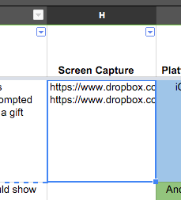
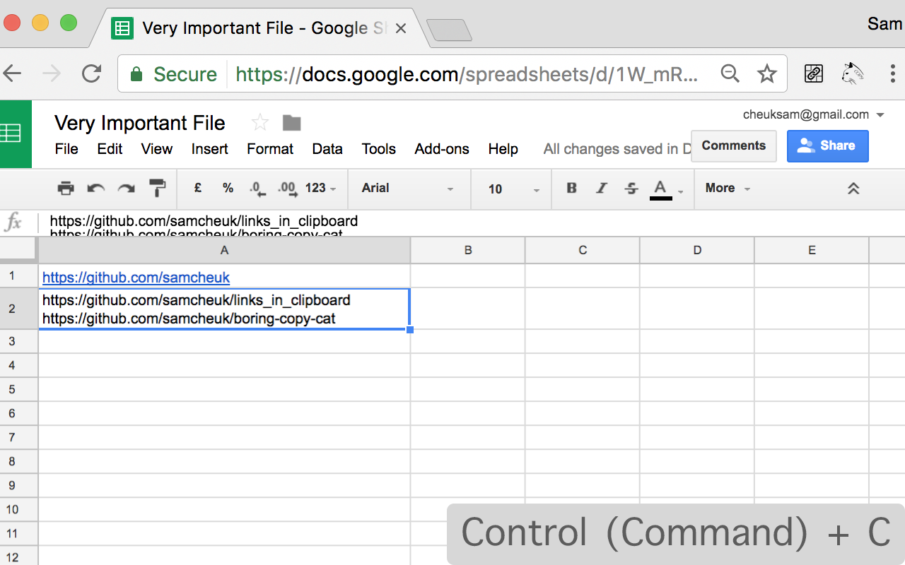
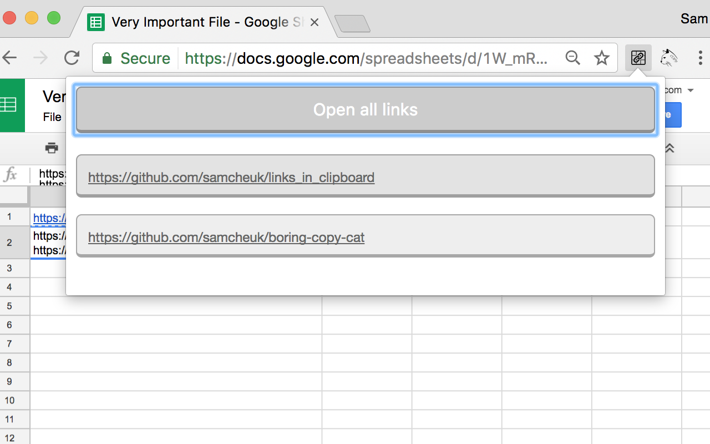

# Links in Clipboard

Chrome extension for open the links with your COPY

More easy when you meet this case in Google Spreadsheet:

### Install

Chrome extension store:

<https://chrome.google.com/webstore/detail/link-in-clipboard/bongldmnpckncminjehcpmocbcdfinnb>

### Usage

1. Copy the cell 

2. Click the extension icon 

